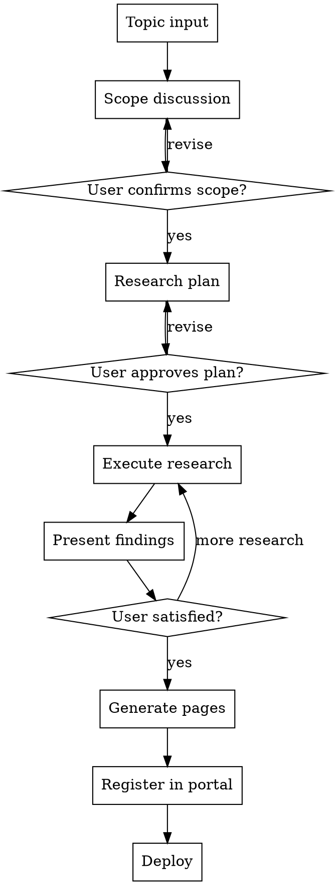

# Atom Research

Structured technology research workflow. Takes a topic from initial discussion through web research to published HTML pages on the Atom Research portal.

## Overview

Input a topic and direction → collaborative discussion to define scope → systematic research → generate pages → register in portal → deploy.

## When to Use

- User asks to research a technology, service, or tool
- User wants to compare multiple products/services
- User asks to add a new topic to the Atom Research portal
- User says "리서치", "조사", "비교", "분석" about a tech topic

## When NOT to Use

- Quick factual questions (just answer directly)
- Code implementation tasks (use other skills)
- Non-technology research topics

## Process



## Phase 1: Scope Discussion

Ask ONE question at a time. Understand before proceeding.

**Must establish:**
1. **What** — topic and specific angles (e.g., "AI Agent 과금 모델 비교" not just "AI Agent")
2. **Who** — target audience (C-level? developer? team lead?)
3. **Why** — decision to be made (adopt? compare? migrate?)
4. **Depth** — executive summary level or deep technical analysis?
5. **Data** — does the user have internal data to include? (pricing sheets, usage data, etc.)

**Output:** One-paragraph scope statement. Get user confirmation before proceeding.

## Phase 2: Research Plan

Define what will be researched and how. Present to user for approval.

**Plan template:**
```
## Research: [Topic]

**Scope:** [one-paragraph from Phase 1]
**Target:** [audience]
**Pages to generate:**
- [page 1] — [purpose]
- [page 2] — [purpose]

**Research areas:**
1. [area] — sources: [where to look]
2. [area] — sources: [where to look]

**Data policy:** Only verified data. Unverified = "미확인" marker.
```

## Phase 3: Execute Research

Use subagents for parallel research when areas are independent.

**Rules:**
- Only report verified data with sources
- Mark unverified items as "— 미확인"
- Never guess or speculate
- Capture source URLs for grounding section
- If user provides internal data, integrate it with clear attribution

**Present findings as structured summary before generating pages.** Get user approval on the data before building HTML.

## Phase 4: Generate Pages

**Design system (must match Atom Research portal):**

```css
/* Colors */
Light: bg #fafafa, card #fff, text #111, mid #444, dim #999, border #eee/#e0e0e0
Dark: bg #111, card #1a1a1a, text #eee, mid #bbb, dim #777, border #222/#333
Accents: blue #0066FF, amber #E68A00, green #00875A, red #CC3333

/* Typography */
Base: 14px, line-height 1.7, Pretendard font
Header: 40px/800, Section: 24px/800, Label: 12px/700 uppercase 3px spacing

/* Components */
Cards: border 1px solid var(--border2), border-radius 12px (no shadows)
Avatars: 44px/32px/24px rounded squares with 2-letter labels
Navigation: border-style buttons, top of page after header
Theme toggle: "Light / Dark" text button, fixed top-right
```

**Page structure:**
- `[topic]/index.html` — main detailed page
- `[topic]/summary.html` — executive summary (if audience is C-level)
- `[topic]/insights.html` — analysis/simulation (if applicable)

**Each page must have:**
- Top nav buttons linking to other pages + portal home
- `prefers-color-scheme` auto + `data-theme` manual toggle + localStorage
- Responsive: 768px breakpoint, single-column blocks on mobile
- Data Sources section with grounding information

## Phase 5: Register in Portal

Add a card to the portal's `index.html` (repo root):

```html
<a href="[topic]/" class="research-card">
  <div class="research-icon" style="background:[color]">[2-letter]</div>
  <div class="research-body">
    <div class="research-title">[Title]</div>
    <div class="research-desc">[Description]</div>
    <div class="research-meta">
      <span class="research-tag">[tag1]</span>
      <span class="research-tag">[tag2]</span>
      <span class="research-date">[YYYY.MM]</span>
    </div>
  </div>
</a>
```

## Phase 6: Deploy

```bash
git add -A
git commit -m "research: add [topic] analysis"
git push
```

Verify GitHub Pages deployment.

## Red Flags — STOP

- Generating pages before user confirms research findings
- Including unverified data without "미확인" marker
- Skipping scope discussion ("just research X")
- Using design patterns that don't match the portal
- Forgetting the Data Sources grounding section

## Quick Reference

| Phase | Gate | Output |
|-------|------|--------|
| Scope | User confirms | One-paragraph scope |
| Plan | User approves | Research plan with areas + pages |
| Research | User reviews findings | Structured data summary |
| Generate | User reviews pages | HTML pages matching design system |
| Register | Automatic | Portal card added |
| Deploy | Automatic | Git push + verify |
